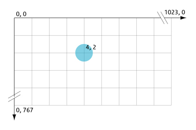

# Hello SkiaSarp

SkiaSharp 是一个适用于 .NET 和 C# 的 2D 图形系统，由开源 Skia 图形引擎支持，在 Google 产品中广泛使用。

## 安装


## 基本概念
### 屏幕坐标系

屏幕的坐标系原点在屏幕的左上角，水平往右、竖直往下为正。屏幕的坐标横坐标用“x”表示，纵坐标用“y”表示，坐标的单位为像素。坐标（4， 2）用表示当前点在原点右方4个像素处，在原点下方2个像素处，



### 颜色 skcolor
颜色的构造方法有很多种，但最常见的是利用rgb三原色来构造，此外还可以加入透明度：

```c#
var color = new skcolor(180, 180, 180, 128);    //四个参数表示red, green, blue, alpha 
```

### 画刷 skpaint
skia是用画刷来完成各种绘制工作的。画刷的构造函数并无参数输入，各种参数是以属性的方式传入的。常见的属性有：颜色、字体、填充类型、画笔宽度等。
```C#
var paint = new SKPaint()
{
    Color = new SKColor(180, 180, 180, 128), //颜色
    StrokeWidth = 2, //画笔宽度
    Typeface = SKTypeface.FromFamilyName("宋体", SKFontStyle.Normal), //字体
    TextSize = 32,  //字体大小
    Style = SKPaintStyle.Stroke, //类型：填充 或 画边界 或全部
    PathEffect = SKPathEffect.CreateDash(LongDash, 0),   //绘制虚线
};
```
### 画布 SKCanvas
Skia所有的绘制是基于画布的。画布来自于SKSurface，SKSurface一般从图像从获取。画布绘制通常直接调用其DrawXXX方法，其函数意义及所需参数大都可通过其名称轻易判断。而本项目中海图直接显示窗体中的SKControl控件上，该控件的的PaintSurface事件中存在画布。
```C#
SKImageInfo imageInfo = new SKImageInfo(300, 250);
using (SKSurface surface = SKSurface.Create(imageInfo))
{
    SKCanvas canvas = surface.Canvas;
    canvas.DrawColor(SKColors.Red);  //填充颜色
}
```

参考:

微软官方文档 https://docs.microsoft.com/zh-cn/xamarin/xamarin-forms/user-interface/graphics/skiasharp/

